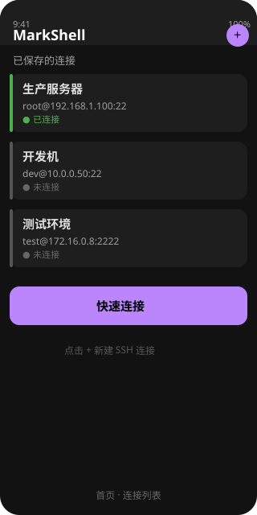
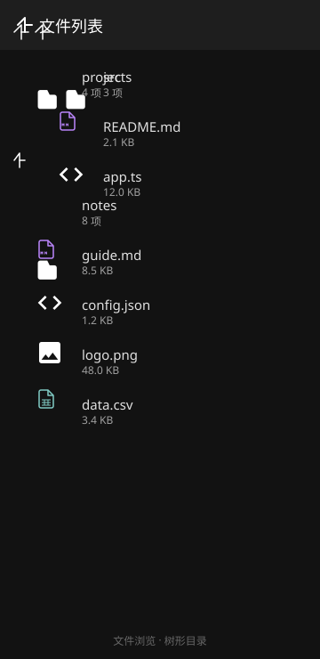
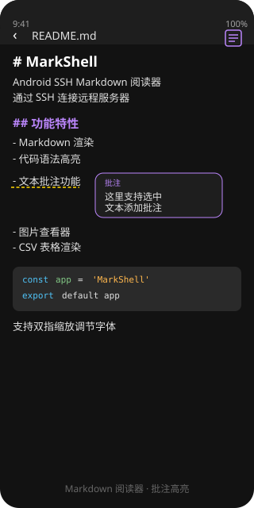
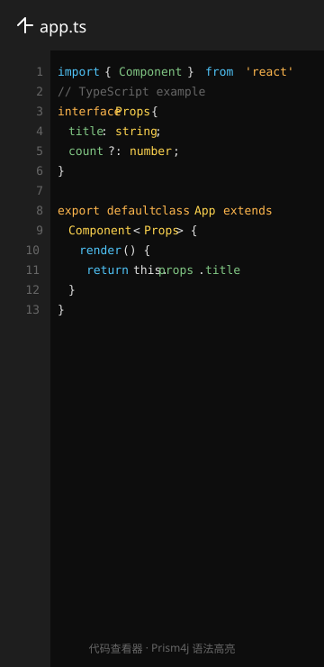

<div align="center">

# MarkShell

<p>
  
</p>

### Android SSH Markdown 阅读器

通过 SSH/SFTP 连接远程服务器，浏览目录并阅读 Markdown 文件，支持文本批注、代码语法高亮、图片查看等功能。

<p>
  
  
  
  
  
</p>

</div>

---

## 功能

### SSH 连接管理
保存多个服务器配置，快速重连，网络切换自动恢复连接；连接分组（折叠展示/分组管理）；连接搜索（首页列表右上搜索按钮/保存的连接工具栏「搜索连接」：按别名、主机、用户名、「主机:端口」、分组实时过滤，大小写不敏感，搜索时隐藏空组、匹配计数显示）；连接复制（连接行长按菜单「复制」：以现有配置预填新建连接表单，别名自动加「（副本）」可改，另存新条目不覆盖原连接）；连接凭据 AES-256-GCM + Android Keystore 加密存储；SSH 密钥认证（私钥+可选口令）；主机指纹校验（known_hosts TOFU/变更告警，SHA-256 指纹）；本地端口转发/隧道规则按服务器隔离保存（连接行长按菜单「端口转发…」，连接列表/保存的连接列表两处入口一致）

### 远程文件浏览
树形目录导航，按文件类型显示图标（Markdown / 代码 / 图片 / CSV），下拉刷新；文件/目录重命名、移动、复制、删除、权限设置（chmod），单文件与多选批量操作；文件/目录属性详情（长按菜单「属性」：类型/完整路径/大小/修改时间/权限符号串与八进制——信息只读视图，目录大小不统计显示「—」）；新建文件/文件夹（工具栏更多菜单「新建」，名称校验、同名不覆盖）；复制远程路径（文件/目录长按菜单、代码/文本/CSV 查看器工具栏「复制路径」、Markdown 阅读器菜单「复制路径」——完整远端路径写入剪贴板，便于运维引用）；下载到本地（文件长按菜单「下载到本地」，系统「另存为」选择保存位置——SAF 零存储权限，默认名为远端文件名可改，流式下载大文件不占内存，完成/失败 toast 提示）；上传文件（工具栏更多菜单「上传…」，系统文件选择器选本地文件——SAF 零存储权限，上传到当前目录，自动取本地显示名，目标同名时确认「覆盖/取消」（不静默覆盖），流式上传，完成/失败 toast 提示并刷新列表）；目录书签/快捷访问；导航（返回键逐级返回上级目录，到根目录时退出；工具栏更多菜单「主目录」一键回到配置主目录，未配置则为服务器 home；工具栏更多菜单「前往路径…」：输入远端绝对路径（或相对当前目录，支持 . / .. 段）直达目录或打开文件，目标不存在/网络异常友好提示）；启动恢复上次浏览目录（未配置主目录时自动回到最后浏览的位置，按服务器隔离、目录失效自动回退主目录）；最近打开（工具栏「历史」，按服务器隔离、上限 50 条自动清理；点击经存在性校验后重新打开，文件已删除自动从历史移除）；两栏预览（大屏/折叠屏），文件排序（按名称/大小/修改时间，列表项显示文件大小与最后修改时间，未知时间显示「—」）；文件名称筛选（工具栏「筛选」，大小写不敏感实时过滤当前已加载列表，切换目录自动清除）；全局递归搜索（工具栏更多菜单「全局搜索…」：从当前目录按名称递归查找（大小写不敏感），可选最大深度（3/5/10/无限制，默认 3），自动忽略 .git/node_modules/__pycache__ 等噪音目录、跳过符号链接目录防循环，结果按相对路径列出（目录恒前、目录带「（目录）」标注），点目录结果直接跳转、点文件结果直接打开；不可读目录自动跳过不中断；搜索全程可取消——进行中常驻提示条带「取消」按钮即时中止（对标 markor），退出页面自动取消以防长搜占用队列，取消不展示已发现的部分结果）；大文件打开确认（>4MB 的文件点击打开前确认「文件较大（N MB）——完全加载可能卡顿」，避免无提示全量加载造成卡顿/内存压力）

### Markdown 渲染
基于 Markwon 引擎，支持标题、列表、表格、任务列表、代码块、图片（**内嵌图片按相对/绝对路径经 SFTP 加载 + LRU 缓存**，http(s)/data 图片走引擎内置加载），双指缩放调节字体大小；任务清单 checkbox 阅读态点击翻转并写回服务器；大纲（TOC）导航（抽屉「批注/大纲」双 Tab，点击跳转）；页内链接点击（外部 URL 打开浏览器/邮件，相对链接按当前文件目录解析打开对应远端文件，`#锚点` 跳转标题）；文档内文本查找（工具栏「查找」，大小写不敏感，上一处/下一处循环跳转 + 计数，跳转落点与批注/大纲导航共用高亮；**编辑模式同样提供「查找/替换」：编辑态工具栏「查找/替换」，替换当前处/全部替换，文件编辑流闭环**）

### 文本批注
选中文本添加批注，黄色虚线下划线标记被批注文本，右侧抽屉管理批注列表，点击快速定位；批注连续导航（上一处/下一处）；批注导出/分享（纯文本/HTML/Markdown 三种格式）；批注与 Markdown 编辑模式协同（编辑后失效批注自动标记）；长文批注定位采用 Aho–Corasick 一次扫描（O(M+命中数)）

### Markdown 远程在线编辑
阅读/编辑单 Activity 切换，编辑保存写回 SFTP；草稿随界面恢复；无变更保存直接退出；编辑模式内置「查找/替换」（大小写不敏感，替换当前处或全部，跳转选区定位）+ 编辑格式工具栏（加粗/斜体/标题 H1-H3/无序列表：选中文字包裹切换，标题与列表按行级前缀切换，与 markor 行为对齐）+ 编辑撤销/重做（格式栏左端撤销/重做按钮：连续打字合并为一步、误操作保存前可逐步回退，对标 markor 编辑历史栈）

### 代码查看器
基于 Prism4j 语法高亮引擎，支持 JS / TS / Java / Python / JSON / CSS / HTML / XML 等 10+ 种语言，行号显示，双指缩放；文档内查找（工具栏「查找」，大小写不敏感、上一处/下一处循环跳转 + 计数，命中词黄色高亮并平滑滚动定位到所在行）；「转到行号…」（工具栏更多菜单：输入行号（1-总行数）按逻辑行跳转，目标整行黄色高亮、纵向居中定位，越界输入跳至文件末尾）

### 纯文本查看器
等宽字体渲染与长行自动换行；行号显示（行号槽按内容版式基线绘制，长行换行时行号仍与逻辑行行首对齐；双指缩放行号同步刷新）；文档内查找（工具栏「查找」，大小写不敏感、上一处/下一处循环跳转 + 计数，命中词黄色高亮并平滑滚动定位到所在行）；「转到行号…」（工具栏更多菜单：输入行号（1-总行数）按逻辑行跳转，目标整行黄色高亮、纵向居中定位，越界输入跳至文件末尾）

### 图片查看器
双指缩放拖拽，弹性回弹边界，长按保存到相册；工具栏「复制路径」（复制当前图片完整远端路径）

### CSV 查看器
表格化渲染，支持表头识别；文档内查找（工具栏「查找」，按单元格内容匹配、大小写不敏感、上一处/下一处循环 + 计数，命中单元格高亮并平滑滚动定位到所在行——文本/纯文本查看器同样提供文档内查找）

## 界面预览

<div align="center">
<table>
<tr>
<td align="center"><br/>首页 · 连接列表</td>
<td align="center"><br/>文件浏览 · 树形目录</td>
</tr>
<tr>
<td align="center"><br/>Markdown 阅读器 · 批注高亮</td>
<td align="center"><br/>代码查看器 · 语法高亮</td>
</tr>
</table>
</div>

## 技术栈

| 库 | 版本 | 用途 |
|---|---|---|
| [JSch](http://www.jcraft.com/jsch/) | 0.1.55 | SSH/SFTP 连接 |
| [Markwon](https://github.com/noties/markwon) | 4.6.2 | Markdown 渲染 |
| [Prism4j](https://github.com/noties/prism4j) | 2.0.0 | 代码语法高亮 |
| [Material Design](https://material.io/develop/android) | 1.11.0 | UI 组件 |
| [AndroidX](https://developer.android.com/jetpack/androidx) | — | 基础库 |

## 项目结构

```
app/src/main/java/com/ssh/mdreader/
├── ui/               # Activity
│   ├── MainActivity              # 首页（连接列表 + 快速连接）
│   ├── ConnectionActivity        # 新建/编辑连接
│   ├── SavedConnectionsActivity  # 保存的连接（分组管理/端口转发入口）
│   ├── FileBrowserActivity       # 远程文件浏览（书签/多选/两栏预览）
│   ├── MarkdownReaderActivity    # Markdown 阅读 + 批注 + 编辑 + 大纲 + 链接
│   ├── CodeViewerActivity        # 代码查看器
│   ├── ImageViewerActivity       # 图片查看器
│   ├── CsvReaderActivity         # CSV 阅读器
│   ├── TextViewerActivity        # 纯文本查看器
│   └── BaseActivity              # 基类
├── ssh/              # SSH 管理器（连接/断连/读写/重连/密钥/指纹/转发）
├── model/            # 数据模型（SshConfig / RemoteFile / AnnotationEntry / PortForwardRule）
├── adapter/          # RecyclerView 适配器（TreeAdapter / AnnotationListAdapter / TocAdapter）
├── util/             # 工具层（AnnotationHelper / Overlay / TocHelper / TaskCheckboxHelper /
│                     #   LinkTargetHelper / FindHelper / ReplaceHelper / CodeHighlighter / PreferenceManager 等，多数纯函数可 JVM 测）
├── widget/           # 自定义 View（SwipeRevealLayout）
└── ui/span/          # 自定义 Span（AnnotationSpan）
```

## 批注系统

批注采用**渲染后文本搜索 + 出现序号**方案：

```
用户选中文本 → 记录 occurrenceIndex → 写入 CSV → 渲染后按序号 setSpan
```

| 特性 | 说明 |
|---|---|
| Markdown 源文件零修改 | 批注只存 CSV，不向 Markdown 插入任何标签 |
| 重复文本消歧 | `occurrenceIndex` 记录被批注文本是第几次出现（0-based） |
| CSV 格式 | `"id","批注内容","原文片段","出现序号"` |
| 渲染流程 | Markwon 正常渲染 → `findNthOccurrence()` 定位 → `setSpan()` |

## 构建

```bash
# 需要 JDK 17 和 Android SDK
export JAVA_HOME=$(/usr/libexec/java_home -v 17)
export ANDROID_HOME=~/Library/Android/sdk
cd ssh-md-reader && gradle assembleDebug
```

## 系统要求

- Android 7.0 (API 24) 及以上
- targetSdk 34

## License

[MIT](LICENSE)
